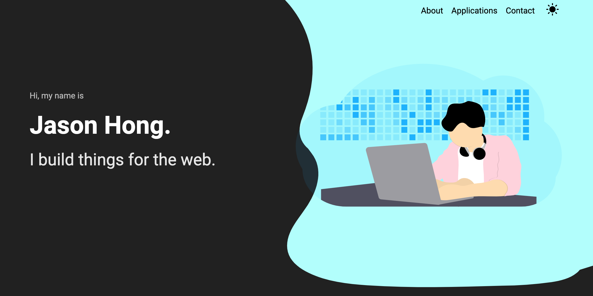

  

<h1 align="center">
  jasonhong1998.com
</h1>

## Table of Contents

1. [Demo](#Demo)
2. [Technologies Used](#Technologies)
3. [Credits](#Credits)
4. [License](#License)

## Demo

<b>Live at:</b> https://www.jasonhong1998.com/

  

## Technologies

| Technologies Used |
|-------------------|
| Gatsby |
| GraphQL |
| React |
| Formik |
| Google reCAPTCHA |

## Credits

A huge shoutout and thanks to Ismail Ghallou for creating this amazing Gatsby starter.

[Gatsby-theme-portfolio](https://github.com/smakosh/gatsby-theme-portfolio)

## License

This project is licensed under the MIT License - see the [LICENSE.md](LICENSE.md) file for more details